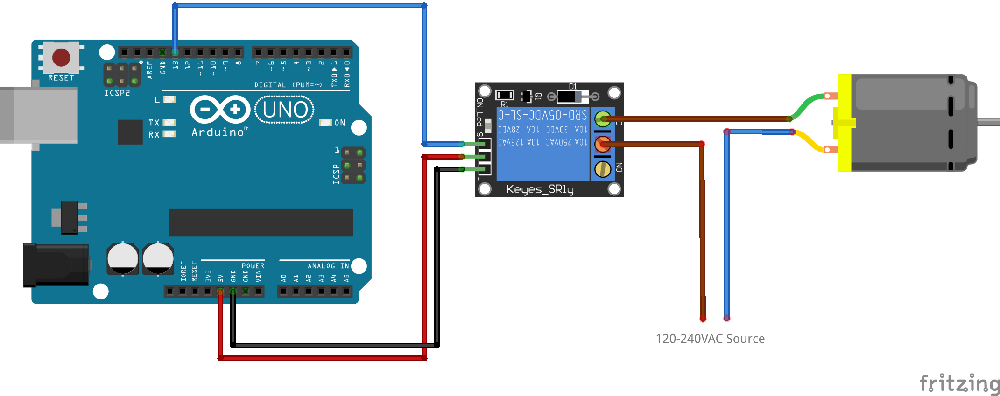

# Simple Timer Relay for Arduino

By [Advenis](https://advensis.co)

## Warning

**Before you continue, remember that if you will connect the relay to High Voltage then incorrect connection or improper use could result 
in serious injuries or death. So be very caution of what you are doing because we take no responsibility for any of your actions.**

## Intro

One of the most useful things you can do with an Arduino is control higher voltage (120-240V) devices like pumps, fans, lights, heaters etc. 
Since the Arduino operates at 5V it can’t control these higher voltage devices directly, but you can use a 5V relay to switch the 120-240V 
current and use the Arduino to control the relay.

## App

See code.
